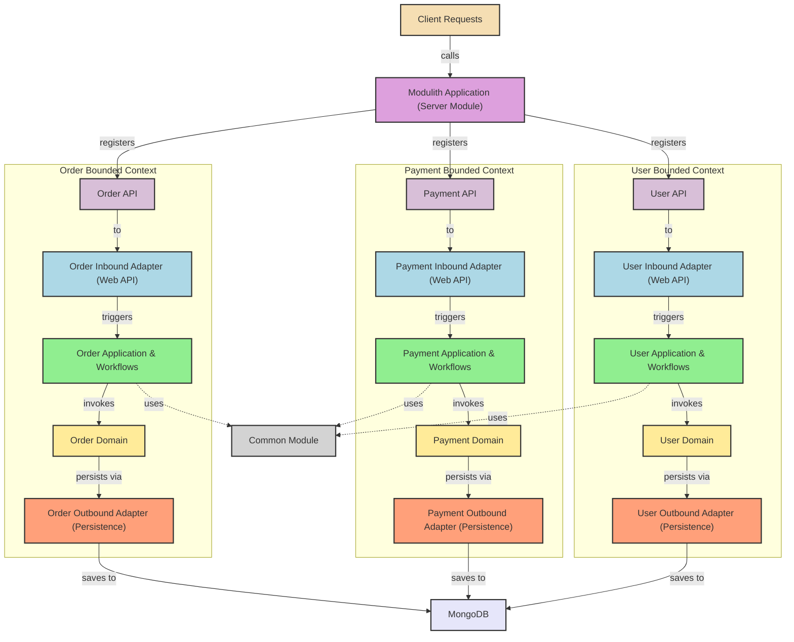

# Spring Boot 3 - Kotlin Modulith Template

This is a template project for a Spring Boot 3 application written in Kotlin. It is based on the modulith architecture pattern.

## Features
- [ ] Does not work
## References used to create this project
- [modulith](https://github.com/edreyer/modulith)
- [codecentric's blog](https://www.codecentric.de/wissens-hub/blog/modularization-the-easy-way-spring-modulith-with-kotlin-and-hexagonal-architecture)

## Goal of this project
